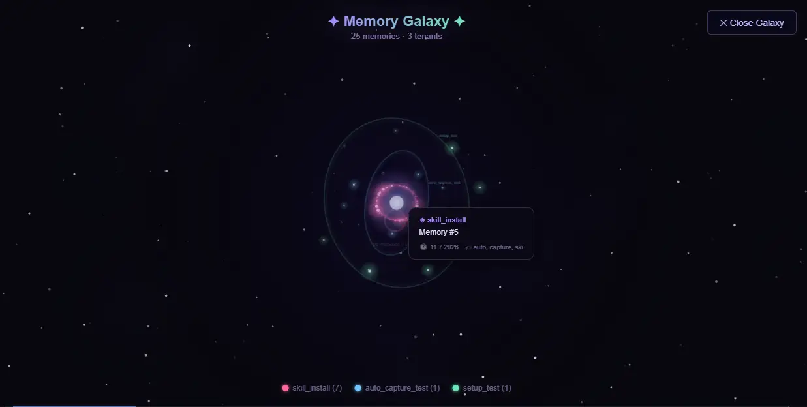
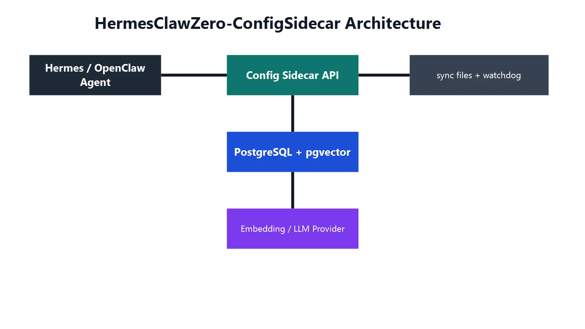




# HermesClaw Zero-Config Sidecar

**PostgreSQL‑backed long‑term memory for Hermes & OpenClaw — with a live Dashboard.**

---

## 📋 Table of Contents

- [One‑Click Install](#-one-click-install)
- [Dashboard](#-dashboard--your-memory-hq)
- [Memory Galaxy](#-memory-galaxy)
- [CLI & MCP Tools](#-cli--mcp-tools)
- [What's Inside](#-whats-inside)
- [Provider & Config](#-provider--config)
- [Verifying It Works](#-verifying-it-works)
- [Screenshots](#-screenshots)
- [Who Is This For](#-who-is-this-for)

---

## 🤖 One‑Click Install

Paste this into **Hermes**, **OpenClaw**, or any AI agent:

```text
Install this project from GitHub:
https://github.com/SunMe1977/HermesClawZero-ConfigSidecar
```

> **⬆️ The agent clones, configures, and starts everything.** No manual steps.
> After ~30s open → [`http://localhost:8010/dashboard`](http://localhost:8010/dashboard)
>
> 📄 See [`install_via_agent.md`](install_via_agent.md) for the detailed agent instructions.

**Manual start** (if you don't have an agent):

```bash
git clone https://github.com/SunMe1977/HermesClawZero-ConfigSidecar.git
cd HermesClawZero-ConfigSidecar
setup.bat          # Windows   (or: ./setup.sh on Linux)
start.bat          # Windows   (or: ./start.sh on Linux)
```

---

## 📊 Dashboard — Your Memory HQ

The **Dashboard** is the main entry point for everything your agent remembers:

| Feature | What you can do |
|---------|----------------|
| **Memory Timeline** | Browse all captured memories chronologically |
| **Semantic Search** | Find memories by meaning, not keywords |
| **Tenant Isolation** | Each scope/chat gets its own view — no data leaks |
| **Memory Health** | Review stale/low-confidence memories, run optimizer |
| **Memory Galaxy** | Interactive 3D galaxy visualization of all memories |
| **Export** | Download memory snapshots anytime |


---

## 🌌 Memory Galaxy

A full‑screen **Canvas‑based galaxy visualization** that brings your memories to life:

| Feature | Effect |
|---------|--------|
| **Tenant Orbits** | Each scope/user gets its own colored orbital ring |
| **Glowing Nodes** | Pulsing memory dots with comet‑like glow trails |
| **Nebula Shader** | Animated gas clouds (blue/violet/pink) with depth |
| **Parallax Depth** | Foreground nodes react faster than background stars |
| **Hover Cards** | Hover any node to see tenant, timestamp, and tags |
| **Zoom & Rotate** | Mouse wheel zoom (0.3×–3×), idle auto-rotation after 5s |
| **Memory Clusters** | Diffuse glowing blobs drifting near their tenant orbit |

Toggle it on from the Dashboard header — no install, no extra setup.

---

## 🧠 What It Does

| Problem | Without Sidecar | With Sidecar |
|---------|----------------|--------------|
| Session continuity | Agent forgets everything on restart | Remembers facts, preferences, decisions |
| Context cost | Long histories burn tokens | Semantic search finds *relevant* memories |
| Setup effort | Manual vector DB, embeddings, API keys | Docker + Ollama, zero config, zero cost |

**Workflow:** `User ↔ Agent ↔ Sidecar API ↔ PostgreSQL + pgvector`

---

## 🔧 CLI & MCP Tools

### CLI (Python)

```bash
python memory.py capture "fact to remember"              # Save a memory
python memory.py search "query" 5                        # Search memories
python memory.py autosave "text" "backup.md"             # Backup a session
```

### MCP Server (6 tools)

For Claude Desktop, Hermes, VS Code, and any MCP client:

```bash
pip install mcp requests
python mcp_server.py
```

| Tool | Description |
|------|-------------|
| `capture_memory` / `search_memory` | Read & write memories |
| `list_recent` / `memory_stats` | Browse & analyze |
| `delete_memory` / `review_memories` | Manage & synthesize |

**Register with Hermes:** `hermes mcp add hermesclawzero --command "python C:\dev\HermesClawZero-ConfigSidecar\mcp_server.py"`

### Agent Skills

Two pre-built skills integrate the sidecar with your agent:

- [**Hermes Skill**](hermes-skill/README.md) — deterministic capture triggers + auto-load for Hermes
- [**OpenClaw Auto-Memory Skill**](openclaw-auto-memory-skill/README.md) — auto-capture facts, preferences, and project context

---

## 📦 What's Inside

| Container | Port | Role |
|-----------|------|------|
| `hermesclawzero-configsidecar-api-1` | `:8010` | FastAPI + Dashboard + capture/search |
| `gbrain-postgres` | `:5666` | PostgreSQL 16 + pgvector |
| `gbrain-ollama` | `:11435` | Ollama (nomic-embed-text) |

**Health:** `curl http://localhost:8010/healthz` → `{"status":"ok"}`

---

## ⚙️ Provider & Config

<details>
<summary>Click to expand</summary>

### Provider Support

| Mode | `AI_PROVIDER` | Embeddings | Key Required |
|------|---------------|------------|-------------|
| **Local (recommended)** | `ollama` | `nomic-embed-text` | None |
| OpenAI | `openai` | OpenAI | `OPENAI_API_KEY` |
| Gemini | `gemini` | Gemini | `GEMINI_API_KEY` |
| Anthropic | `anthropic` | Via embedding provider | `ANTHROPIC_API_KEY` |
| OpenRouter | `openrouter` | OpenRouter | `OPENROUTER_API_KEY` |

### Compose Provider Override

```bash
COMPOSE_AI_PROVIDER=openrouter docker compose up -d --force-recreate api
```

### Environment Variables

| Variable | Default | Description |
|----------|---------|-------------|
| `API_KEY` | — | Required for all protected endpoints |
| `DB_PASSWORD` | — | PostgreSQL password |
| `AI_PROVIDER` | `ollama` | `ollama` \| `openai` \| `gemini` \| `anthropic` \| `openrouter` |
| `MEM_PUBLIC_URL` | `http://localhost:8010` | Base URL for client scripts |
| `OLLAMA_HOST` | `http://host.docker.internal:11434` | Ollama endpoint |
| `AUTO_UPDATE_ENABLED` | `false` | Auto-pull from GitHub |
| `DASHBOARD_PASSWORD` | `HermesDash!2026` | Basic Auth for dashboard |

### Security

- Multi-tenant isolation via `chat_id` + `scope_id`
- API: `x-api-key` header or `?key=` query param
- Dashboard: Basic Auth
- Rate limiting: 30 req/min `/capture`, 60 req/min `/search`

</details>

---

## ✅ Verifying It Works

```bash
# 1. Health check
curl http://localhost:8010/healthz
# → {"status":"ok"}

# 2. Capture a test memory
python memory.py capture "Hello from README" test

# 3. Search it back
python memory.py search "hello" 3

# 4. Open the Dashboard
# → http://localhost:8010/dashboard
```

> 🔍 Having trouble? Check the [Troubleshooting section in the OpenClaw skill](openclaw-auto-memory-skill/README.md#troubleshooting).

---

## 🖼️ Screenshots





*Available immediately at [`http://localhost:8010/dashboard`](http://localhost:8010/dashboard) after `docker compose up`.*

---

## 🤝 Who Is This For?

AI developers · Hermes users · OpenClaw users · Self-hosters · MCP enthusiasts

---

---

## 🏆 Compared to the Ecosystem

HermesClawZero is **the only memory system** that combines all of these in a single Docker stack:

| Need | gBrain | ZeroMem | Hermes Built‑In | OpenClaw Memory | Cognee | **HermesClawZero** |
|---|---|---|---|---|---|---|
| **Knowledge Graph** | ⚠️ Self-wiring | ❌ | ❌ | ❌ | ✅ | ✅ **Entities + Rels + Traversal** |
| **Memory Tiers** | ❌ | ❌ | ⚠️ 3-layer | ❌ | ❌ | ✅ **Hot/Warm/Standard/Cold** |
| **Versioning** | ❌ | ✅ DAG | ❌ | ❌ | ❌ | ✅ **memory_versions table** |
| **Compression** | ❌ | ❌ | ❌ | ❌ | ❌ | ✅ **Intelligent multi-line** |
| **Consolidation** | ✅ Dream cycle | ❌ | ❌ | ✅ Dreaming | ❌ | ✅ **Embedding-clustering** |
| **Deduplication** | ❌ | ❌ | ❌ | ❌ | ❌ | ✅ **Vector-distance** |
| **Editor / Merge** | ❌ | ✅ DAG | ❌ | ❌ | ❌ | ✅ **Inline + batch merge** |
| **Feedback** | ❌ | ❌ | ❌ | ❌ | ❌ | ✅ **Upvote/downvote** |
| **Temporal Search** | ❌ | ❌ | ❌ | ❌ | ✅ | ✅ **days_back filter** |
| **Memory Nudge** | ❌ | ❌ | ✅ Periodic | ❌ | ❌ | ✅ **/nudge endpoint** |
| **Auto-Import** | ❌ | ❌ | n/a | ❌ | ❌ | ✅ **Hermes state.db** |
| **Auto-Sync** | ❌ | ❌ | n/a | ❌ | ❌ | ✅ **5min daemon** |
| **Dashboard (UI)** | ❌ | ❌ | ✅ Desktop | ❌ | ❌ | ✅ **Memory Galaxy + Health** |
| **Graph UI** | ❌ | ❌ | ❌ | ❌ | ❌ | ✅ **Entity browser in dash** |
| **MCP Tools** | 30+ | ❌ | Built-in | ❌ | ❌ | **6 tools** |
| **API Keys** | Needs OpenAI | ❌ | **None** | ❌ | Needs LLM key | **✅ None (Ollama)** |
| **Install** | `npx gbrain` | Complex | Built-in | Plugin | `pip install` | **🤖 One‑click via agent** |

### Why switch?

> **You get all of this in a single `docker compose up`:**
> — PostgreSQL + pgvector + HNSW indexes — not SQLite, not files
> — Knowledge graph with entity extraction + graph traversal — not just vector search
> — Memory tiers + versioning + compression — no other system has all three
> — A full animated Dashboard with galaxy view, health panel, and interactive tools
> — Zero API keys, zero cloud, zero data leaving your machine
> — One‑click install: paste the GitHub URL into any Hermes or OpenClaw agent

---

## 🙌 Contributions Welcome

Contributions of all kinds are welcome —  
feel free to open [PRs](https://github.com/SunMe1977/HermesClawZero-ConfigSidecar/pulls) or [issues](https://github.com/SunMe1977/HermesClawZero-ConfigSidecar/issues).

See [`CONTRIBUTING.md`](CONTRIBUTING.md) for code style, commit conventions, and PR workflow.

---

Built for AI Agent autonomy.

---

<p align="center">
  <em>
    If you enjoy this project, consider sharing your experience —
    a short video review, a tweet, or a TikTok post helps others discover it.
  </em>
</p>

---

<a href="https://github.com/nousresearch/hermes-agent"></a>
<a href="https://github.com/openclaw/openclaw"></a>
<a href="https://ollama.com/"></a>

- [Hermes Agent GitHub](https://github.com/nousresearch/hermes-agent)
- [OpenClaw Website](https://openclaw.ai)
- [Ollama Website](https://ollama.com)
