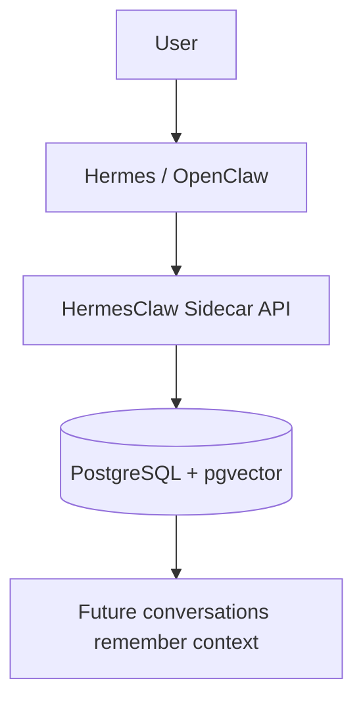
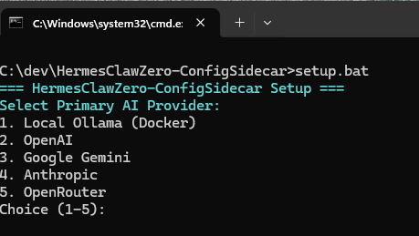




# HermesClaw Zero-Config Sidecar
## 🧠 Give Hermes & OpenClaw a Persistent Brain
Zero-configuration long-term memory powered by PostgreSQL + pgvector.

- ✅ Works in minutes
- ✅ Windows + Linux
- ✅ Fully local / self-hosted
- ✅ Docker-based setup
- ✅ Open source

The HermesClawZero-ConfigSidecar is a practical sidecar that gives AI agents durable, queryable long-term memory.

## Why You'll Love It
- 🧠 AI remembers conversations across sessions
- ⚡ Quick setup with minimal config
- 🐳 Docker-first deployment
- 💾 PostgreSQL + pgvector persistence
- 🔍 Semantic search for memory recall
- 🔒 Self-hosted and private
- 🌍 Windows + Linux support
- 🤖 Built for Hermes + OpenClaw workflows

## What Problem Does This Solve?
Without persistent memory:
- ❌ AI forgets previous sessions
- ❌ Important details are lost over time
- ❌ Context windows become expensive
- ❌ Long projects lose continuity

HermesClaw solves this by giving each AI workflow a persistent PostgreSQL-backed memory layer.

## Workflow At A Glance


## Quick Start
Run the setup script for your OS. It verifies dependencies, creates `.env`, and can optionally set up Ollama.

### Fastest Start (Hermes/OpenClaw)
Paste this into Hermes or OpenClaw:

```text
Install this project from GitHub:
https://github.com/SunMe1977/HermesClawZero-ConfigSidecar
```



### Manual Setup
- Windows: `setup.bat`
- Linux/macOS: `bash setup.sh`

### Start the Stack
- Windows: `start.bat`
- Linux/macOS: `./start.sh`
- API docs: `http://localhost:8010/docs`
- Dashboard: `http://localhost:8010/dashboard`
- Health: `http://localhost:8010/healthz`

## Runtime Provider Override (Compose-First)
Runtime provider precedence in Compose:
1. `COMPOSE_AI_PROVIDER`
2. `AI_PROVIDER`
3. fallback `openrouter`

Effective runtime expression:
`AI_PROVIDER=${COMPOSE_AI_PROVIDER:-${AI_PROVIDER:-openrouter}}`

Example:
```bash
COMPOSE_AI_PROVIDER=openrouter docker compose up -d --force-recreate api
```

Windows + Ollama remains compatible when `.env` contains `AI_PROVIDER=ollama`.

---

## Requirements
- Python 3.11+
- Docker Desktop
- Optional: Ollama (local embeddings)

## Environment Variables
Set these in `.env` (never commit secrets):
- `API_KEY`
- `DB_PASSWORD`
- Provider key depending on setup:
  - `OPENROUTER_API_KEY`
  - `OPENAI_API_KEY`
  - `GEMINI_API_KEY`
  - `ANTHROPIC_API_KEY`
- Runtime selectors:
  - `AI_PROVIDER`
  - `EMBEDDING_PROVIDER`
  - `COMPOSE_AI_PROVIDER`

## Security Notes
- Multi-tenant isolation is active via `chat_id` + `scope_id` filtering.
- Dashboard is protected by Basic Auth.
- API routes use `x-api-key`/`?key=` checks.
- Keep `.env` private and rotate keys if exposed.
- **Rate Limiting**: The system uses a custom internal middleware for rate limiting (no external slowapi dependency) to keep the footprint lightweight. Limits are set to 30 requests/minute for /capture and 60 requests/minute for /search. Returning HTTP 429 on exceeding the limit.

## Deployment
Standard deployment uses Docker Compose (`start.bat` or `./start.sh`).

Recommended verification after start:
- `http://localhost:8010/healthz`
- `http://localhost:8010/version`

## Release Hardening Status
Implemented:
- Multi-tenant memory isolation (`chat_id` + `scope_id`)
- OpenRouter retry/backoff + degraded fallback behavior
- Per-IP rate limiting for `/capture` and `/search`
- Startup cleanup of orphaned embeddings

Optional next hardening steps:
- PostgreSQL auth hardening (`scram-sha-256`)
- Scheduled `pg_dump` backup script

---

## Provider Support
| Mode | AI_PROVIDER | Embeddings | Ollama Required | Keys |
|------|-------------|------------|-----------------|------|
| Local Ollama | `ollama` | `nomic-embed-text` | Yes | None |
| OpenAI | `openai` | OpenAI embeddings | No | `OPENAI_API_KEY` |
| Gemini | `gemini` | Gemini embeddings | No | `GEMINI_API_KEY` |
| Anthropic | `anthropic` | via `openrouter`/`openai`/`gemini` | No | `ANTHROPIC_API_KEY` + embedding key |
| OpenRouter | `openrouter` | OpenRouter embeddings | No | `OPENROUTER_API_KEY` |

## Architecture
Sidecar flow:
- Agent -> Sidecar API
- Sidecar API -> PostgreSQL + pgvector
- Sidecar API -> Embedding/LLM provider
- Sidecar API -> Dashboard + Optimizer
- Watchdog -> syncs local files into memory


## Feature Comparison
| Feature | Default Agent Setup | Zero-Config Sidecar |
|---|---|---|
| Persistent memory across sessions | Partial | Yes |
| Self-hosted data path | Varies | Yes |
| PostgreSQL storage | No | Yes |
| Dashboard operations | No | Yes |
| Zero-config setup | No | Yes |

## Product Comparison (Verified)
Legend:
- ✅ = explicitly supported / documented
- ⚠️ = available but not the primary/default path
- ❌ = not a stated core focus in official docs

| Product | Open Source Core | Self-Host | Managed Cloud Option | PostgreSQL Native Focus | Hermes/OpenClaw Focus | Notes |
|---|---|---|---|---|---|---|
| HermesClaw Zero-Config Sidecar | ✅ | ✅ | ❌ | ✅ | ✅ | Built for Hermes/OpenClaw memory workflows |
| Mem0 | ✅ | ✅ | ✅ | ❌ | ❌ | OSS + self-host + managed platform |
| gBrain | ✅ | ✅ | ⚠️ | ✅ | ✅ | Strong Hermes/OpenClaw alignment |
| OpenMemory | ✅ | ✅ | ❌ | ❌ | ❌ | ⚠️ Marked as sunset by maintainers |
| Chroma | ✅ | ✅ | ✅ | ❌ | ❌ | General vector DB/retrieval stack |
| Weaviate | ✅ | ✅ | ✅ | ❌ | ❌ | General vector DB + cloud ecosystem |
| Pinecone | ❌ | ❌ | ✅ | ❌ | ❌ | Managed-first vector platform |

## Why Use This Instead Of Generic Memory Stacks?
- ✅ Tailored for Hermes + OpenClaw usage
- ✅ Zero-config, Docker-first local deployment
- ✅ PostgreSQL-backed persistence with pgvector
- ✅ Multi-tenant memory isolation already integrated

## What We Still Need (Gap Check)
- 🧪 Benchmark section with reproducible latency/memory numbers
- 🎞️ Animated setup/demo GIF for fast product understanding
- 🔁 Hybrid retrieval implementation (semantic + lexical fusion)
- 📝 Memory summarization pipeline for long histories
- 🕸️ Knowledge graph layer for relationship-aware recall
- 📊 Stronger dashboard UX (more filtering, better timelines)
- 🚀 GitHub release workflow (`v1.0.0` and ongoing changelog discipline)
- 🏷️ GitHub topics for discoverability (`hermes`, `openclaw`, `memory`, `pgvector`, etc.)

## Who Is This For?
- 👩‍💻 AI developers building long-running assistants
- 🤖 Hermes users
- 🧩 OpenClaw users
- 🏠 Self-hosters and local-LLM enthusiasts
- 🛠️ MCP and agent-workflow developers

## Roadmap
- ✅ PostgreSQL storage
- ✅ pgvector semantic memory
- ✅ Docker deployment
- ✅ Dashboard
- ✅ Multi-tenant isolation
- ✅ Semantic search
- ⬜ Hybrid retrieval
- ⬜ Memory summarization
- ⬜ Knowledge graph support
- ⬜ Dashboard/UI improvements
- ⬜ MCP auto-discovery improvements

## Project Positioning
Inspired by recent advances in long-term AI memory, this project focuses on zero-configuration deployment, self-hosting, and practical day-to-day agent usage.

## Tools
- Ingest: drag-and-drop into `ingest.bat`
- Maintenance: `maintenance.bat`
- Capture: `python scripts/memory.py capture "text"`
- Search: `python scripts/memory.py search "query"`
- Autosave: `python scripts/memory.py autosave "content" "filename.txt"`

## Database View
")

## Dashboard


## Troubleshooting
- 401 Unauthorized: ensure `API_KEY` matches server config.
- Sync not running: verify `memory_sync.py` process.
- Missing logs: confirm files are written to `sync/`.
- Dashboard error: check `http://localhost:8010/healthz` and DB settings.

## FAQ
### Is this production-ready?
Yes for self-hosted single-team usage.

### Where is data stored?
PostgreSQL (`gbrain`) persisted with Docker volume `pgdata`.

### Why does dashboard auth differ from API auth?
Dashboard uses Basic Auth. API routes use `x-api-key` (or `?key=` where supported).

Built for AI Agent autonomy.

<a href="https://github.com/nousresearch/hermes-agent"></a>
<a href="https://github.com/openclaw/openclaw"></a>
<a href="https://ollama.com/"></a>

<ul>
<li><a href="https://github.com/nousresearch/hermes-agent">Hermes Agent GitHub</a></li>
<li><a href="https://openclaw.ai">OpenClaw Website</a></li>
<li><a href="https://ollama.com">Ollama Website</a></li>
</ul>
