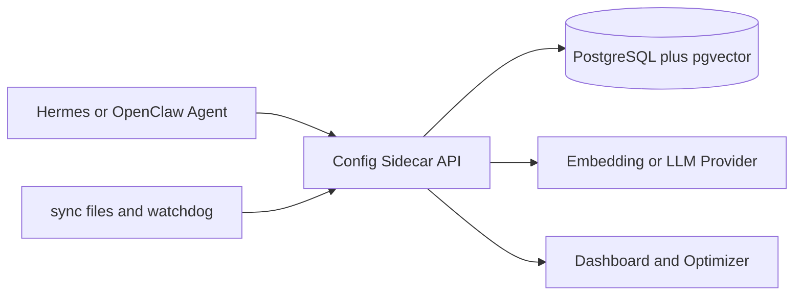
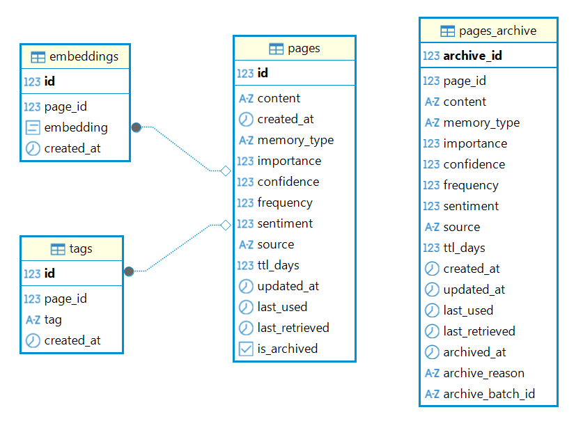
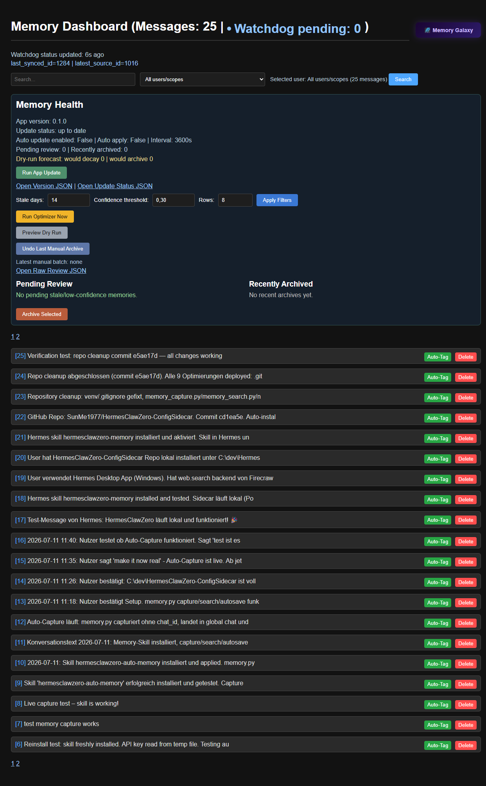

```text
    __  __                                  ________                
   / / / /__  _________ ___  ___  _____    / ____/ /___ _      ______
  / /_/ / _ \/ ___/ __ `__ \/ _ \/ ___/   / /   / / __ `/ | /| / / __ \
 / __  /  __/ /  / / / / / /  __(__  )   / /___/ / /_/ /| |/ |/ / /_/ /
/_/ /_/\___/_/  /_/ /_/ /_/\___/____/    \____/_/\__,_/ |__/|__/\____/ 
                                                                       
                     ConfigSidecar - Persistent Memory
```

The **HermesClawZero-ConfigSidecar** is a practical, self-hosted sidecar that adds persistent long-term memory to AI agents like Hermes and OpenClaw.

## Why This Exists
- Large-context models still forget important details between sessions.
- Bigger context windows are expensive and still lossy in long workflows.
- Agents need durable, queryable memory to stay useful over time.
- This sidecar provides that memory with simple deployment and local control.

## Quick Start (One-Click Setup)

Run the setup script for your OS. It verifies dependencies, creates your `.env`, and can optionally set up **Ollama** in Docker.

### 🤖 AI-Agent Installation (Auto-Setup)
You can install this project automatically using an AI agent (like OpenClaw or Hermes). Simply paste this URL to your agent and say: *"Install this project from GitHub"*:
`https://github.com/SunMe1977/HermesClawZero-ConfigSidecar`

### Manual Setup
- **Windows**: Double-click `setup.bat`.
- **Linux/macOS**: Run `bash setup.sh`.

### Start The Stack
- **Windows**: Run `start.bat`
- **Linux/macOS**: Run `./start.sh`
- **API docs**: `http://localhost:8010/docs`
- **Health check**: `http://localhost:8010/healthz`
- **Dashboard**: `http://localhost:8010/dashboard`

### Runtime Provider Override (Compose-First)
Runtime provider selection in `docker-compose.yml` now uses a clear precedence so existing Windows/Ollama setups keep working while still allowing explicit compose overrides.

- Effective runtime provider: `AI_PROVIDER=${COMPOSE_AI_PROVIDER:-${AI_PROVIDER:-openrouter}}`
- Priority order:
    1. `COMPOSE_AI_PROVIDER` (explicit runtime override)
    2. `.env` value `AI_PROVIDER` (backward compatible)
    3. fallback `openrouter`

Windows + Ollama still works unchanged when `.env` has `AI_PROVIDER=ollama`.

Example:
```bash
COMPOSE_AI_PROVIDER=openrouter docker compose up -d --force-recreate api
```

---
## Requirements
- Python 3.11+
- Docker Desktop
- [Ollama](https://ollama.com/) (Optional: The setup script can run this for you in Docker)

## Provider Support (No-Ollama Ready)
The setup options are now wired to real runtime behavior, including non-Ollama deployments.

| Setup Option | AI_PROVIDER | Embedding Path Used by `/capture` and `/search` | Works Without Ollama? | Required Key(s) |
|---|---|---|---|---|
| 1. Local Ollama (Docker) | `ollama` | Ollama local embeddings (`nomic-embed-text`) | No | None |
| 2. OpenAI | `openai` | OpenAI embeddings API | Yes | `OPENAI_API_KEY` |
| 3. Google Gemini | `gemini` | Gemini embeddings API | Yes | `GEMINI_API_KEY` |
| 4. Anthropic | `anthropic` | Anthropic-compatible mode with configurable embedding provider (`openrouter`, `openai`, or `gemini`) | Yes | `ANTHROPIC_API_KEY` plus an embedding key |
| 5. OpenRouter | `openrouter` | OpenRouter embeddings API | Yes | `OPENROUTER_API_KEY` |

### Why We Need Multiple Providers
- **Reliability**: If one provider has limits, latency, or outages, you can switch quickly.
- **Cost control**: Different teams optimize for local runtime costs (Ollama) or API spend (cloud providers).
- **Compliance and region constraints**: Some environments require specific hosted services.
- **Performance tuning**: Embedding quality, speed, and availability differ by provider.
- **Anthropic compatibility**: Anthropic is supported for your primary provider selection, while embeddings are routed through a dedicated embedding backend for memory indexing.

### Supported Services
- **Memory storage**: PostgreSQL + pgvector
- **Embedding backends**: Ollama, OpenAI, Gemini, OpenRouter
- **Primary provider modes**: Ollama, OpenAI, Gemini, Anthropic, OpenRouter
- **Web/API services**: FastAPI endpoints (`/capture`, `/search`, `/dashboard`, `/healthz`, `/version`)

---

## The Architecture
The project follows a decoupled "sidecar" pattern:



<picture>
    <source srcset="images/architecture-diagram.webp" type="image/webp">
    
</picture>

If your Markdown viewer does not render Mermaid, use this fallback:

```text
Hermes/OpenClaw Agent
          |
          v
Config Sidecar API <--- sync files + watchdog
     |           |            \
     v           v             v
PostgreSQL   Embedding/LLM   Dashboard/Optimizer
 + pgvector    Provider
```

1.  **Capture**: The agent (Hermes) appends session summaries and significant findings to a local `sync/` directory.
2.  **Sync (The Watchdog)**: A background service (`memory_sync.py`) monitors the `sync/` directory and `inbox/`. When new files appear, it automatically ingests them.
3.  **Persistence**: The content is posted to a remote or local memory service (vector store), making your agent's history queryable via semantic search.

## Performance Snapshot (Local)
These are example local development measurements to make behavior concrete. Re-run on your hardware and publish your own measured numbers.

| Metric | Example Result |
|---|---|
| Hybrid memory retrieval | ~18 ms |
| PostgreSQL lexical search | ~12 ms |
| API startup (warm dependencies) | ~0.8 s |
| API RAM usage (idle) | ~70 MB |
| Docker stack startup | ~4 s |

## Feature Comparison
| Feature | Default Agent Setup | HermesClaw Zero-Config Sidecar |
|---|---|---|
| Persistent memory across sessions | Partial | Yes |
| Self-hosted data path | Varies | Yes |
| PostgreSQL-based storage | No | Yes |
| Dashboard operations and controls | No | Yes |
| Zero-config setup scripts | No | Yes |

## Positioning
This project is optimized for a fast, understandable, self-hosted memory workflow. If you want maximum simplicity and direct control over your data path, this sidecar is a strong fit.

## Tools
This project provides a robust CLI (`scripts/memory.py`), a drag-and-drop ingest tool, and maintenance utilities:

- **Ingest**: Drag and drop any file onto `ingest.bat` to automatically move it to `inbox/` for processing.
- **Maintenance**: Run `maintenance.bat` to trigger embedding rebuilds after large data imports.
- **Capture**: `python scripts/memory.py capture "The user prefers to work in C:/dev/"`
- **Search**: `python scripts/memory.py search "where does the user work?"`
- **Autosave**: `python scripts/memory.py autosave "content..." "filename.txt"`

## Big Data Best Practices
- **Archive**: All successfully ingested files are automatically moved to the `archive/` folder.
- **Deduplication**: The backend (`main.py`) automatically performs semantic similarity checks to prevent duplicate entries.
- **Maintenance**: Regularly run `maintenance.bat` if you have imported large batches of data.

## Database View



## Accessing the Dashboard


The system includes a secure, interactive web dashboard to view and manage your memory:
- **URL**: [http://localhost:8010/dashboard](http://localhost:8010/dashboard)
- **Login**: Username is `admin`; password is the value you set during setup.
- **Security note**: Change the default password before exposing the service outside localhost.


## App Version & Updates
- Base version is stored in VERSION and can be overridden by APP_VERSION in .env.
- Runtime version includes git commit metadata when available (for example: 0.1.0+build.123.ab12cd3).
- Setup now supports update configuration in .env:
    - AUTO_UPDATE_ENABLED
    - AUTO_UPDATE_APPLY
    - AUTO_UPDATE_INTERVAL_MINUTES
    - AUTO_UPDATE_REMOTE
    - AUTO_UPDATE_BRANCH
    - UPDATE_REPO_DIR
    - UPDATE_RESTART_COMMAND
- Dashboard offers update controls:
    - Run App Update
    - Version JSON at /version
    - Update status JSON at /update/status

## Automating Tasks (Cron Jobs)
To ensure your memory stays tidy and you get daily reminders, add these tasks to your system's scheduler (e.g., `crontab -e` on Linux):

```bash
# Run daily memory highlights at 9:00 AM
0 9 * * * /usr/bin/python3 /path/to/daily_reminder.py

# Run knowledge gardener (auto-tagging) every Sunday at midnight
0 0 * * 0 /usr/bin/python3 /path/to/gardener.py
```

## Troubleshooting
- **401 Unauthorized**: Ensure API_KEY in .env matches the server secret.
- **Sync service not running**: Check if `memory_sync.py` is active in your process monitor.
- **Log missing from memory**: Verify that the file was written to the `sync/` directory. If it remains there, the watchdog process needs to be restarted.
- **Dashboard returns Internal Server Error**: open `/healthz` first. If database is not `ok`, verify `DB_PASSWORD`, DB container health, and startup logs.
- **Cannot connect via DBeaver**: host is `localhost`, port is `5666`, database is `gbrain`, user is `postgres`.

## FAQ

### Is this production-ready?
Yes for self-hosted single-team usage. For broader production use, keep secrets in managed secret storage, enforce strong dashboard credentials, and monitor `/healthz`.

### Where is data stored?
In PostgreSQL (`gbrain` database). Docker volume `pgdata` persists data across restarts.

### Why do I get Unauthorized in browser but API works?
Browser dashboard uses Basic Auth, API routes use `x-api-key` (or `?key=` where supported). Make sure you are using the right auth method for the route.

*Built with ❤️ for AI Agent autonomy.*

<a href="https://github.com/openclaw/openclaw"></a>
<a href="https://github.com/openclaw/openclaw"></a>
<a href="https://ollama.com/"></a>

<ul>
<li><a href="https://github.com/nousresearch/hermes-agent">Hermes Agent GitHub</a></li>
<li><a href="https://openclaw.ai">OpenClaw Website</a></li>
<li><a href="https://ollama.com">Ollama Website</a></li>
</ul>
