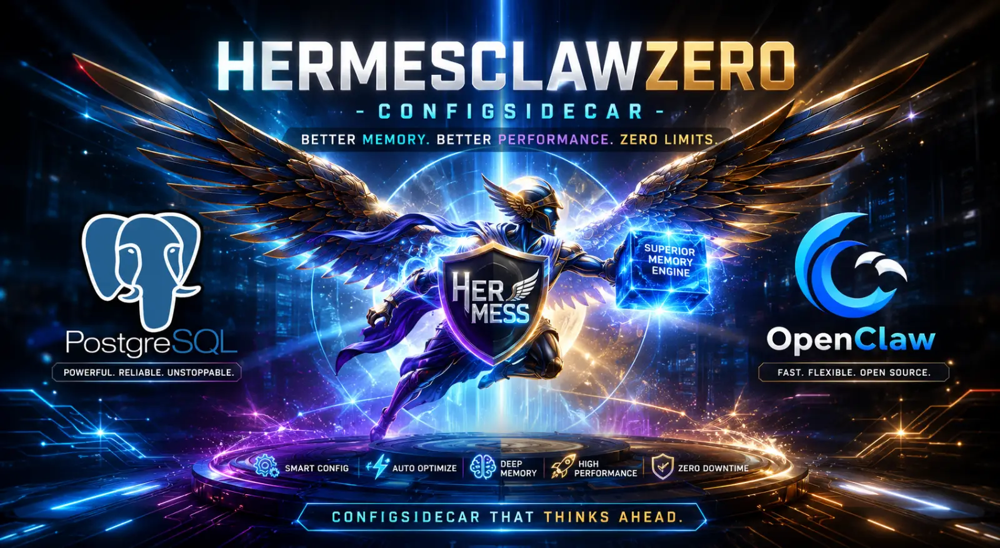




# HermesClaw Zero-Config Sidecar
Persistent Memory for AI Agents (Hermes, OpenClaw)
Self-hosted | Zero-Config | PostgreSQL + pgvector | Multi-Tenant

The HermesClawZero-ConfigSidecar is a practical sidecar that gives AI agents durable, queryable long-term memory.

## Why This Exists
- Session context disappears and important details are lost over time.
- Very large prompts are expensive and still lossy in longer workflows.
- Agents need durable memory that can be searched, filtered, and maintained.

## Quick Start
Run the setup script for your OS. It verifies dependencies, creates `.env`, and can optionally set up Ollama.

### Fastest Start (Hermes/OpenClaw)
Paste this into Hermes or OpenClaw:

```text
Install this project from GitHub:
https://github.com/SunMe1977/HermesClawZero-ConfigSidecar
```

### Manual Setup
- Windows: `setup.bat`
- Linux/macOS: `bash setup.sh`

### Start the Stack
- Windows: `start.bat`
- Linux/macOS: `./start.sh`
- API docs: `http://localhost:8010/docs`
- Dashboard: `http://localhost:8010/dashboard`
- Health: `http://localhost:8010/healthz`

## Runtime Provider Override (Compose-First)
Runtime provider precedence in Compose:
1. `COMPOSE_AI_PROVIDER`
2. `AI_PROVIDER`
3. fallback `openrouter`

Effective runtime expression:
`AI_PROVIDER=${COMPOSE_AI_PROVIDER:-${AI_PROVIDER:-openrouter}}`

Example:
```bash
COMPOSE_AI_PROVIDER=openrouter docker compose up -d --force-recreate api
```

Windows + Ollama remains compatible when `.env` contains `AI_PROVIDER=ollama`.

---

## Requirements
- Python 3.11+
- Docker Desktop
- Optional: Ollama (local embeddings)

## Environment Variables
Set these in `.env` (never commit secrets):
- `API_KEY`
- `DB_PASSWORD`
- Provider key depending on setup:
  - `OPENROUTER_API_KEY`
  - `OPENAI_API_KEY`
  - `GEMINI_API_KEY`
  - `ANTHROPIC_API_KEY`
- Runtime selectors:
  - `AI_PROVIDER`
  - `EMBEDDING_PROVIDER`
  - `COMPOSE_AI_PROVIDER`

## Security Notes
- Multi-tenant isolation is active via `chat_id` + `scope_id` filtering.
- Dashboard is protected by Basic Auth.
- API routes use `x-api-key`/`?key=` checks.
- Keep `.env` private and rotate keys if exposed.

## Deployment
Standard deployment uses Docker Compose (`start.bat` or `./start.sh`).

Recommended verification after start:
- `http://localhost:8010/healthz`
- `http://localhost:8010/version`

## Release Hardening Status
Implemented:
- Multi-tenant memory isolation (`chat_id` + `scope_id`)
- OpenRouter retry/backoff + degraded fallback behavior
- Per-IP rate limiting for `/capture` and `/search`
- Startup cleanup of orphaned embeddings

Optional next hardening steps:
- PostgreSQL auth hardening (`scram-sha-256`)
- Scheduled `pg_dump` backup script

---

## Provider Support
| Mode | AI_PROVIDER | Embeddings | Ollama Required | Keys |
|------|-------------|------------|-----------------|------|
| Local Ollama | `ollama` | `nomic-embed-text` | Yes | None |
| OpenAI | `openai` | OpenAI embeddings | No | `OPENAI_API_KEY` |
| Gemini | `gemini` | Gemini embeddings | No | `GEMINI_API_KEY` |
| Anthropic | `anthropic` | via `openrouter`/`openai`/`gemini` | No | `ANTHROPIC_API_KEY` + embedding key |
| OpenRouter | `openrouter` | OpenRouter embeddings | No | `OPENROUTER_API_KEY` |

## Architecture
Sidecar flow:
- Agent -> Sidecar API
- Sidecar API -> PostgreSQL + pgvector
- Sidecar API -> Embedding/LLM provider
- Sidecar API -> Dashboard + Optimizer
- Watchdog -> syncs local files into memory

## Feature Comparison
| Feature | Default Agent Setup | Zero-Config Sidecar |
|---|---|---|
| Persistent memory across sessions | Partial | Yes |
| Self-hosted data path | Varies | Yes |
| PostgreSQL storage | No | Yes |
| Dashboard operations | No | Yes |
| Zero-config setup | No | Yes |

## Inspired by gBrain
This project is inspired by [gBrain](https://github.com/garrytan/gbrain). Thanks to Garry Tan and contributors for helping popularize practical long-term agent memory workflows.

Use-case split:
- gBrain: excellent for local, personal memory experiments
- HermesClaw Zero-Config Sidecar: optimized for shared bots, VPS/server deployment, and continuously running multi-agent workflows

## Tools
- Ingest: drag-and-drop into `ingest.bat`
- Maintenance: `maintenance.bat`
- Capture: `python scripts/memory.py capture "text"`
- Search: `python scripts/memory.py search "query"`
- Autosave: `python scripts/memory.py autosave "content" "filename.txt"`

## Troubleshooting
- 401 Unauthorized: ensure `API_KEY` matches server config.
- Sync not running: verify `memory_sync.py` process.
- Missing logs: confirm files are written to `sync/`.
- Dashboard error: check `http://localhost:8010/healthz` and DB settings.

## FAQ
### Is this production-ready?
Yes for self-hosted single-team usage.

### Where is data stored?
PostgreSQL (`gbrain`) persisted with Docker volume `pgdata`.

### Why does dashboard auth differ from API auth?
Dashboard uses Basic Auth. API routes use `x-api-key` (or `?key=` where supported).

Built for AI Agent autonomy.
