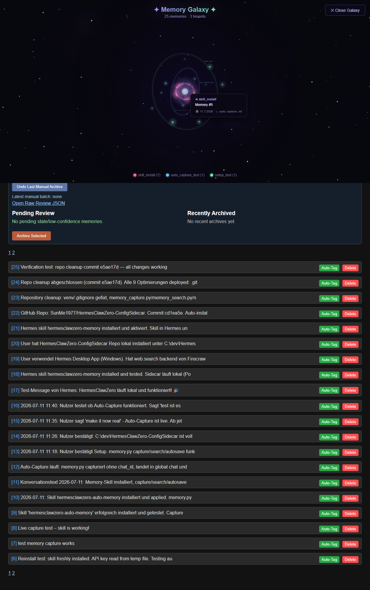
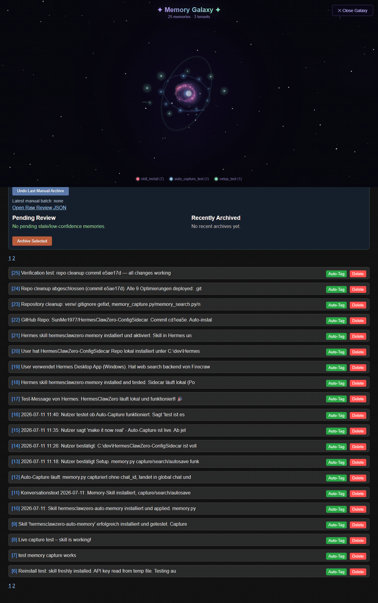




# HermesClaw Zero-Config Sidecar

**PostgreSQL‑backed long‑term memory for Hermes & OpenClaw — with a live Dashboard.**  

### 🤖 One‑Line Install

Paste this into **Hermes**, **OpenClaw**, or any AI agent:

```text
Install this project from GitHub:
https://github.com/SunMe1977/HermesClawZero-ConfigSidecar
```

**⬆️ The agent clones, configures, and starts everything.** No manual steps.  
After 30s open → [`http://localhost:8010/dashboard`](http://localhost:8010/dashboard)

---

### 🚀 10‑Second Demo


**Manual start** (if you don't have an agent):
```bash
git clone https://github.com/SunMe1977/HermesClawZero-ConfigSidecar.git
cd HermesClawZero-ConfigSidecar
setup.bat          # Windows   (or: ./setup.sh on Linux)
start.bat          # Windows   (or: ./start.sh on Linux)
```

---

## 📊 Dashboard — Your Memory HQ

The **Dashboard** is the main entry point for everything your agent remembers:

| Feature | What you can do |
|---------|----------------|
| **Memory Timeline** | Browse all captured memories chronologically |
| **Semantic Search** | Find memories by meaning, not keywords |
| **Tenant Isolation** | Each scope/chat gets its own view — no data leaks |
| **Memory Health** | Review stale/low-confidence memories, run optimizer |
| **Memory Galaxy** | Interactive 3D galaxy visualization of all memories |
| **Export** | Download memory snapshots anytime |

> 🖼️ Dashboard — memory timeline, health, and the **Memory Galaxy** button.


---

## 🌌 Memory Galaxy — Interactive Memory Universe

A full‑screen **Canvas‑based galaxy visualization** that brings your memories to life:

| Feature | Effect |
|---------|--------|
| **Tenant Orbits** | Each scope/user gets its own colored orbital ring |
| **Glowing Nodes** | Pulsing memory dots with comet‑like glow trails |
| **Nebula Shader** | Animated gas clouds (blue/violet/pink) with depth |
| **Parallax Depth** | Foreground nodes react faster than background stars on mouse move |
| **Hover Cards** | Hover any node to see tenant, timestamp, and tags |
| **Zoom & Rotate** | Mouse wheel zoom (0.3×–3×), idle auto‑rotation after 5s |
| **Memory Clusters** | Diffuse glowing blobs drifting near their tenant orbit |

> 🖼️ Memory Galaxy in action — open it anytime from the Dashboard.





Toggle it on from the Dashboard header — no install, no extra setup.

## 🧠 What It Does

| Problem | Without Sidecar | With Sidecar |
|---------|----------------|--------------|
| Session continuity | Agent forgets everything on restart | Remembers facts, preferences, decisions |
| Context cost | Long histories burn tokens | Semantic search finds *relevant* memories |
| Setup effort | Manual vector DB, embeddings, API keys | Docker + Ollama, zero config, zero cost |

**Workflow:** User ↔ Agent ↔ Sidecar API ↔ PostgreSQL + pgvector

---

## 🔧 CLI Tools (power users)

```bash
python memory.py capture "fact to remember"        # Save a memory
python memory.py search "query" 5                  # Search memories
python memory.py autosave "text" "backup.md"       # Backup a session
```

---

## 🧩 MCP Server

6 tools for Claude Desktop, Hermes, VS Code, and any MCP client:

```bash
pip install mcp requests
python mcp_server.py
```

| Tool | Description |
|------|-------------|
| `capture_memory` / `search_memory` | Read & write memories |
| `list_recent` / `memory_stats` | Browse & analyze |
| `delete_memory` / `review_memories` | Manage & synthesize |

**Register with Hermes:** `hermes mcp add hermesclawzero --command "python C:\dev\HermesClawZero-ConfigSidecar\mcp_server.py"`

---

## ⚙️ Advanced — Provider & Config

<details>
<summary>Click to expand</summary>

### Provider Support

| Mode | `AI_PROVIDER` | Embeddings | Key Required |
|------|---------------|------------|-------------|
| **Local (recommended)** | `ollama` | `nomic-embed-text` | None |
| OpenAI | `openai` | OpenAI | `OPENAI_API_KEY` |
| Gemini | `gemini` | Gemini | `GEMINI_API_KEY` |
| Anthropic | `anthropic` | Via embedding provider | `ANTHROPIC_API_KEY` |
| OpenRouter | `openrouter` | OpenRouter | `OPENROUTER_API_KEY` |

### Compose Provider Override

```bash
COMPOSE_AI_PROVIDER=openrouter docker compose up -d --force-recreate api
```

### Environment Variables

| Variable | Default | Description |
|----------|---------|-------------|
| `API_KEY` | — | Required for all protected endpoints |
| `DB_PASSWORD` | — | PostgreSQL password |
| `AI_PROVIDER` | `ollama` | `ollama` \| `openai` \| `gemini` \| `anthropic` \| `openrouter` |
| `MEM_PUBLIC_URL` | `http://localhost:8010` | Base URL for client scripts |
| `OLLAMA_HOST` | `http://host.docker.internal:11434` | Ollama endpoint |
| `AUTO_UPDATE_ENABLED` | `false` | Auto-pull from GitHub |
| `DASHBOARD_PASSWORD` | `HermesDash!2026` | Basic Auth for dashboard |

### Security

- Multi-tenant isolation via `chat_id` + `scope_id`
- API: `x-api-key` header or `?key=` query param
- Dashboard: Basic Auth
- Rate limiting: 30 req/min `/capture`, 60 req/min `/search`

</details>

---

## 🖼️ Screenshots


*The dashboard is available immediately at [`http://localhost:8010/dashboard`](http://localhost:8010/dashboard) after `docker compose up`.*

---

## 📦 What's Included

| Container | Port | Role |
|-----------|------|------|
| `hermesclawzero-configsidecar-api-1` | `:8010` | FastAPI + Dashboard + capture/search |
| `gbrain-postgres` | `:5666` | PostgreSQL 16 + pgvector |
| `gbrain-ollama` | `:11435` | Ollama (nomic-embed-text) |

**Health:** `curl http://localhost:8010/healthz`

---

## 📋 Roadmap

| Status | Feature |
|--------|---------|
| ✅ | PostgreSQL + pgvector, Docker, Dashboard, Multi-tenant, Semantic search, MCP server |
| ⬜ | Hybrid retrieval (lexical + vector fusion), Knowledge graph, Dashboard UI v2 |

---

## 🤝 Who Is This For?

AI developers · Hermes users · OpenClaw users · Self-hosters · MCP enthusiasts

---

Built for AI Agent autonomy.

<a href="https://github.com/nousresearch/hermes-agent"></a>
<a href="https://github.com/openclaw/openclaw"></a>
<a href="https://ollama.com/"></a>

- [Hermes Agent GitHub](https://github.com/nousresearch/hermes-agent)
- [OpenClaw Website](https://openclaw.ai)
- [Ollama Website](https://ollama.com)
